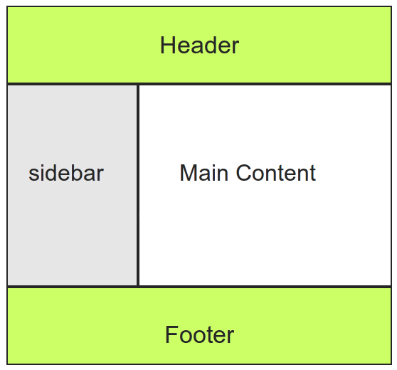

What is layout?
===============

A **layout** defines the visual structure for a user interface such as a page or a widget. To say simpler, **layout** is a
recursive system that leads to an element  positioned, and drawn. The **layout component** provides easy way to manipulate
this structure.

Let's start from a review of some page in an application, what do we see? Usually, the content could be separated in 
a set of blocks grouped by content or structure. 

So, imagine that we have following page structure: 

We split the page into following blocks hierarchy:

* root
   * header
   * body
     * sidebar
     * main content
   * footer

Each of these blocks will have children in the final structure, so we can call them **container*

**Container** -- is a block type that responsible for holding and rendering of its children.

**Final block** -- block that renders a content based on data, but it couldn't have children.

Each block has type that 

The **layout** should be built by providing set of actions named **[layout update](./layout_update.md)**. 
A layout update could be defined for specific route and for specific [theme](./theme_definition.md). 

See the [Layout component](../../../../Component/Layout/README.md) documentation for further detailed explanation.

Block types
-----------

The **OroLayoutBundle** brings a set of block types that allows easily build HTML layout structure. 

| Type name | Type class | Default HTML output |
|-----------|------------|-------------|
| `root` | [RootType.php](../../Layout/Block/Type/RootType.php) | `<html>` |
| `head` | [HeadType.php](../../Layout/Block/Type/HeadType.php) | `<head>` |
| `meta` | [MetaType.php](../../Layout/Block/Type/MetaType.php) | `<meta>` |
| `style` | [StyleType.php](../../Layout/Block/Type/StyleType.php) | `<style>` with content or `<link>` with external resource |
| `script` | [ScriptType.php](../../Layout/Block/Type/ScriptType.php) | `<script>` |
| `external_resource` | [ExternalResourceType.php](../../Layout/Block/Type/ExternalResourceType.php) | `<link>` |
| `body` | [BodyType.php](../../Layout/Block/Type/BodyType.php) | `<body>` |
| `form` | [FormType.php](../../Layout/Block/Type/FormType.php) | `<form>` |
| `form_field` | [FormFieldType.php](../../Layout/Block/Type/FormFieldType.php) |  Block will rendered differently depending on field type |
| `fieldset` | [FieldsetType.php](../../Layout/Block/Type/FieldsetType.php) | `<fieldset>` |
| `link` | [LinkType.php](../../Layout/Block/Type/LinkType.php) | `<a>` |
| `list` | [ListType.php](../../Layout/Block/Type/ListType.php) | `<ul>` |
| `text` | [TextType.php](../../Layout/Block/Type/TextType.php) | Text node |
